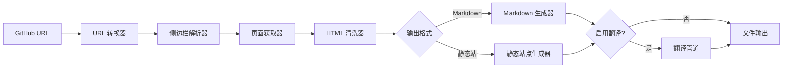
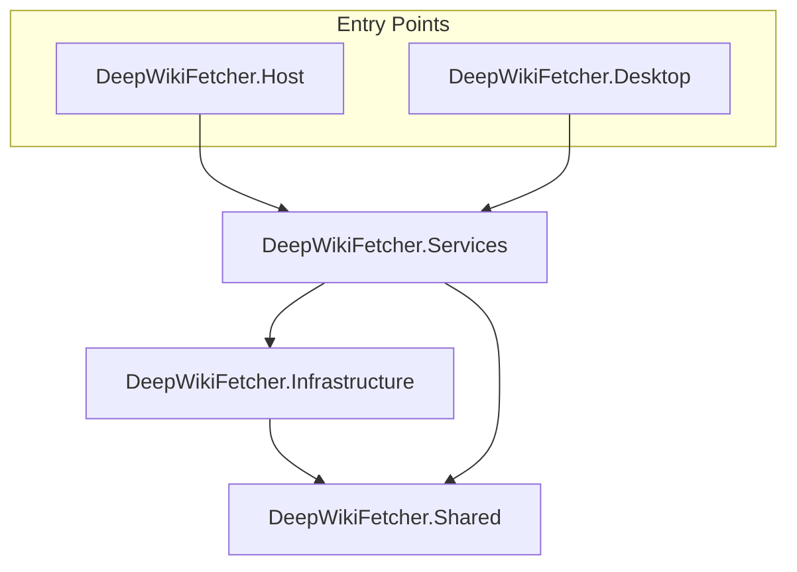
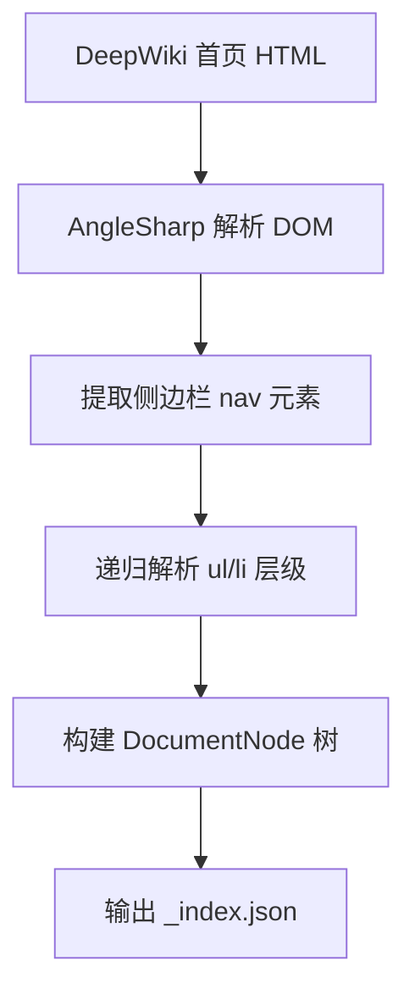
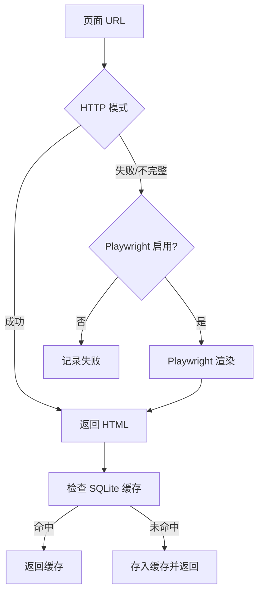
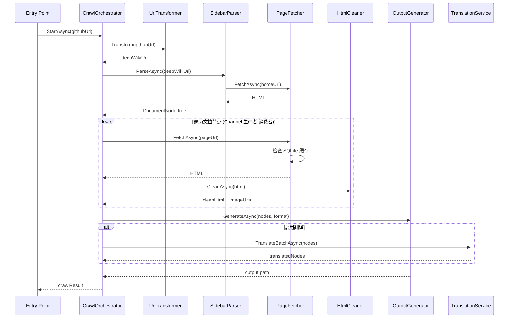
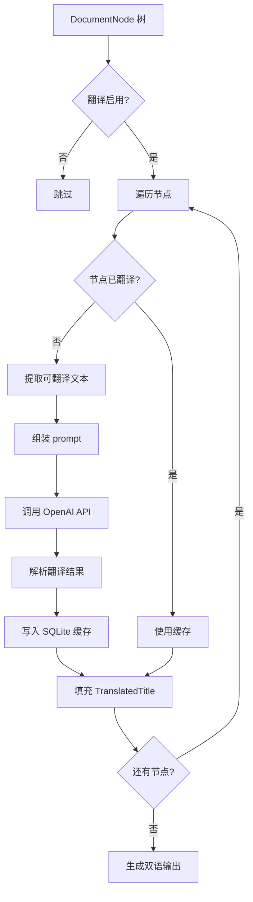
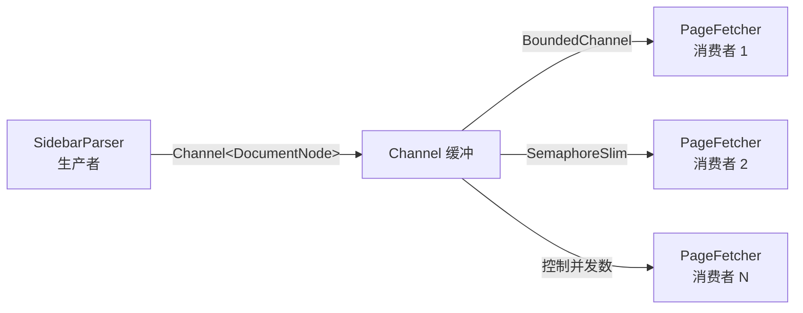

# DeepWikiFetcher 架构设计

## 系统概览

DeepWikiFetcher 是一个 .NET 10 文档抓取工具，输入 GitHub 仓库 URL，输出 DeepWiki
完整文档集。支持 CLI 与 MAUI 桌面端两种入口，输出格式可选 Markdown 或静态文档站，
内容支持中英双语自动翻译。

### 入口矩阵

| 入口 | 技术 | 场景 |
|------|------|------|
| CLI | .NET Console (`DeepWikiFetcher.Host`) | CI/CD、批量处理、自动化 |
| 桌面端 | .NET MAUI (`DeepWikiFetcher.Desktop`) | 图形化配置、进度可视化、单次使用 |

两个入口共享同一个 Services/Infrastructure/Data 层，通过接口注入实现 UI 无关。

### 核心业务流程



## 项目结构

```text
DeepWikiFetcher.slnx
├── DeepWikiFetcher.Shared/          # Data 层：Models, Options, Enums, Constants
├── DeepWikiFetcher.Infrastructure/   # Infrastructure 层：外部依赖封装
├── DeepWikiFetcher.Services/         # Services 层：核心业务逻辑
├── DeepWikiFetcher.Host/            # CLI 入口（Console App）
└── DeepWikiFetcher.Desktop/         # MAUI 桌面端入口
```

**依赖方向**：



- Entry Points → Services → Infrastructure → Shared
- 禁止反向依赖
- Shared 被所有上层依赖

## 分层架构

```text
┌──────────────────────────────────────────────────────┐
│  Entry Points (Host / Desktop)                       │
│  CLI: Program.cs / DI / 命令行参数解析                 │
│  MAUI: Pages / ViewModels / 配置持久化 / 进度报告      │
│  不包含业务逻辑                                       │
├──────────────────────────────────────────────────────┤
│  Services 层                                         │
│  UrlTransformer / SidebarParser / PageFetcher         │
│  HtmlCleaner / OutputGenerator / TranslationService   │
│  StaticSiteGenerator / CrawlOrchestrator              │
│  所有业务逻辑                                         │
├──────────────────────────────────────────────────────┤
│  Infrastructure 层                                    │
│  HttpClientFactory / PlaywrightManager                │
│  SqliteCacheManager / TranslationApiClient            │
│  AssetDownloader / PollyPipeline                      │
│  外部依赖封装                                         │
├──────────────────────────────────────────────────────┤
│  Shared 层 (Models / Options / Enums)                 │
│  数据结构与配置模型                                    │
└──────────────────────────────────────────────────────┘
```

## 服务边界

### URL 转换器 (`UrlTransformer`)

**职责**：将 GitHub URL 转换为 DeepWiki URL。

| 输入 | 输出 |
|------|------|
| `https://github.com/owner/repo` | `https://deepwiki.com/owner/repo` |
| `https://github.com/owner/repo/tree/main/docs` | `https://deepwiki.com/owner/repo/docs` |

**规则**：
- 仅做 URL 结构映射，不发起网络请求
- 输入校验：非法 GitHub URL MUST 抛出 `ArgumentException`

### 侧边栏解析器 (`SidebarParser`)

**职责**：解析 DeepWiki 页面的侧边栏，提取文档目录树。



**规则**：
- 输出 `DocumentNode` 树结构，包含 `Title`、`TranslatedTitle`、`Url`、`Children`、`Depth`
- `TranslatedTitle` 初始为 `null`，翻译阶段填充
- 每个节点 MUST 分配层级编号（如 `1.1`、`2.3.1`）
- 解析失败 MUST 记录结构化日志并跳过该节点

### 页面获取器 (`PageFetcher`)

**职责**：下载 DeepWiki 页面内容，支持 HTTP（优先）和 Playwright（兜底）双模式。



**规则**：
- HTTP 模式 MUST 作为默认首选
- Playwright 模式 MUST 通过配置开关控制，默认禁用
- 两种实现 MUST 实现同一 `IPageFetcher` 接口
- 每次 Playwright 使用后 MUST 释放浏览器实例

### HTML 清洗器 (`HtmlCleaner`)

**职责**：清洗 DeepWiki 页面 HTML，移除导航、页脚等非文档内容，提取图片引用。

| 操作 | 目标 |
|------|------|
| 移除 `<nav>` | 侧边栏副本 |
| 移除 `<footer>` | 页脚 |
| 移除 `.admonition` 外的样式 | 保留内容结构 |
| 保留 `<article>` 或 `.content` | 核心文档区域 |
| 修复相对链接为绝对链接 | 保证链接可用 |
| 提取 `` 标签 `src` | 收集图片引用列表 |

### 爬取编排器 (`CrawlOrchestrator`)

**职责**：协调整个爬取流水线，管理生产者-消费者模型。



### 输出生成器 (`OutputGenerator`)

**职责**：根据输出格式生成最终文件。由 `MarkdownWriter`（Markdown 格式）和
`StaticSiteGenerator`（静态站点格式）两个实现组成。

```text
          ┌───────────────────┐
          │  IOutputGenerator  │
          └────────┬──────────┘
                   │
      ┌────────────┴────────────┐
      │                         │
      ▼                         ▼
┌──────────────┐    ┌───────────────────┐
│MarkdownWriter│    │StaticSiteGenerator│
│ .md 文件输出  │    │ VuePress /        │
│              │    │ Docusaurus 兼容   │
└──────────────┘    └───────────────────┘
```

#### Markdown 输出结构

```text
Output/{owner}/{repo}/
├── index.html              # 语言选择入口（自动检测浏览器语言）
├── .nojekyll               # GitHub Pages 配置
├── _metadata.json          # 爬取统计
├── zh-cn/
│   ├── _index.json         # 中文目录树
│   ├── _sidebar.md         # 中文侧边栏导航
│   └── pages/
│       ├── 1-installation.md
│       └── ...
├── en/
│   ├── _index.json         # 英文目录树（原始）
│   ├── _sidebar.md         # 英文侧边栏导航
│   └── pages/
│       ├── 1-installation.md
│       └── ...
└── assets/
    └── images/             # 共享图片资源（中英共用）
```

#### 静态站点输出结构

```text
Output/{owner}/{repo}/
├── index.html              # 语言选择入口
├── .nojekyll
├── _metadata.json
├── zh-cn/
│   ├── index.html          # 中文首页
│   ├── sidebar.json        # 中文侧边栏（VuePress 格式）
│   ├── pages/
│   │   ├── 1-installation.html
│   │   └── ...
│   └── config.js           # 站点配置
├── en/
│   ├── index.html
│   ├── sidebar.json
│   ├── pages/
│   │   └── ...
│   └── config.js
└── assets/
    ├── images/
    ├── css/                # 站点样式
    └── js/                 # 语言切换逻辑
```

### 翻译服务 (`TranslationService`)

**职责**：调用 OpenAI 兼容 API 进行英→中翻译。不翻译代码块和技术标识符。



**翻译规则**：

| 内容类型 | 处理 |
|----------|------|
| 正文段落 | ✅ 翻译 |
| YAML frontmatter `title` | ✅ 翻译 |
| 代码块（`` ``` ``） | ❌ 保留原文，不做任何修改 |
| 行内代码（`` ` ``） | ❌ 保留原文 |
| 链接 URL | ❌ 保留原文 |
| frontmatter `url` / `depth` | ❌ 保留原文 |
| HTML 标签属性 | ❌ 保留原文 |

**Prompt 设计原则**：
- 保持 Markdown 结构和格式完全不变
- 仅翻译自然语言文本，不翻译代码和技术标识符
- 保留原始换行和缩进

### 资源下载器 (`AssetDownloader`)

**职责**：下载页面中的图片等静态资源到 `assets/images/`，中英版本共享。

**规则**：
- 仅下载来自 DeepWiki 域名的图片（避免下载外部 CDN 资源）
- 文件名使用 URL 的 SHA256 哈希 + 原始扩展名
- 下载失败不中断主流程，记录警告日志
- `HtmlCleaner` 中提取的图片引用在此处处理

## 翻译架构

翻译采用 OpenAI 兼容接口（`/v1/chat/completions`），通过 `ITranslationApiClient` 封装。
用户在 MAUI 前端配置 Base URL、API Key 和模型。详细配置项见 `appsettings.template.json` 中
`Translation` 节。

翻译结果持久化到 SQLite `translation_cache` 表，缓存键为 `SHA256(source_text)`，
相同原文即使出现在不同页面也只翻译一次。完整表结构见 `docs/design/database.md`。

## 并发与弹性

### 生产者-消费者模型



**规则**：
- `Channel<T>` 使用 `BoundedChannelOptions`，容量上限通过配置控制
- `SemaphoreSlim` 限制最大并发数，默认 3
- 所有消费者完成或 Channel 关闭后，主流程结束

### Polly 弹性管道

```text
请求 → 限流 → 重试(指数退避) → 熔断 → 响应
```

| 策略 | 参数 | 适用 |
|------|------|------|
| 限流 | 30 次/分钟，间隔 ≥ 2s | DeepWiki 请求 |
| 限流 | `RequestDelayMs` 可配 | 翻译 API |
| 重试 | 最多 3 次，指数退避 $2^n \times 1s$ | HTTP + 翻译 API |
| 熔断 | 连续 5 次失败，熔断 30s | HTTP + 翻译 API |
| 降级 | 单页失败不中断整体 | 爬取 + 翻译 |

## 缓存策略（SQLite）

| 维度 | 策略 |
|------|------|
| 存储引擎 | SQLite (`cache.db`，位于输出根目录) |
| 页面缓存键 | URL 的 SHA256 哈希 |
| 翻译缓存键 | 原文文本的 SHA256 哈希 |
| 页面过期 | 默认 24 小时，可配置 |
| 翻译过期 | 永不过期（除非更换模型，此时按 model 区分） |
| 命中 | 跳过网络请求/翻译 API，直接返回缓存内容 |
| 增量 | 仅爬取缓存中不存在的页面 |

完整表结构（`page_cache`、`translation_cache`、`crawl_metadata`）见 `docs/design/database.md`。

## MAUI 桌面端

### 页面设计

```text
┌─────────────────────────────────────────┐
│  DeepWikiFetcher                        │
├─────────────────────────────────────────┤
│  [设置]  [抓取]  [历史]                  │
├─────────────────────────────────────────┤
│                                         │
│  当前页面内容                            │
│                                         │
├─────────────────────────────────────────┤
│  状态栏: Ready / Crawling... 3/42 pages │
└─────────────────────────────────────────┘
```

### 页面功能

| 页面 | 功能 |
|------|------|
| **设置** | GitHub URL 输入、输出目录选择、输出格式切换（MD/静态站）、翻译开关、API Base URL + Key 输入、模型选择、并发数滑块、Playwright 开关 |
| **抓取** | 开始/暂停/取消按钮、实时进度条、页面级日志流、当前抓取 URL 显示 |
| **历史** | 历史抓取记录列表（从 SQLite `crawl_metadata` 读取）、点击可打开输出目录 |

### 配置持久化

MAUI 端配置通过 `Preferences` + `SecureStorage` 持久化。非敏感配置（并发数、输出格式等）
使用 `Preferences`，敏感字段（API Key）使用 `SecureStorage` 加密存储。

## Git 管理策略

- 配置文件：`appsettings.json` 及所有变体（除 `appsettings.template.json`）不提交
- 输出目录：`Output/` 不提交
- SQLite：`*.db`、`*.db-shm`、`*.db-wal` 不提交
- 配置模板：`appsettings.template.json` 提交到仓库作为参考，完整内容见该文件

## 关键接口

| 接口 | 层 | 职责 |
|------|-----|------|
| `IUrlTransformer` | Services | GitHub → DeepWiki URL 转换 |
| `ISidebarParser` | Services | 解析侧边栏，生成 `DocumentNode` 树 |
| `IPageFetcher` | Services | HTTP / Playwright 双模式页面获取 |
| `IHtmlCleaner` | Services | 清洗 HTML，提取图片引用 |
| `IOutputGenerator` | Services | 输出生成（Markdown / 静态站） |
| `ITranslationService` | Services | 翻译编排：调度 API + 缓存 |
| `ICrawlOrchestrator` | Services | 爬取流水线总协调 |
| `ITranslationApiClient` | Infrastructure | OpenAI 兼容 API 调用 |
| `IAssetDownloader` | Infrastructure | 图片等静态资源下载 |
| `ICacheManager` | Infrastructure | SQLite 缓存读写 |

完整接口签名见各项目源代码，数据模型定义见 `docs/design/data-model.md`。

## 关键数据模型

| 模型 | 层 | 核心字段 |
|------|-----|----------|
| `DocumentNode` | Shared | `Title`, `TranslatedTitle`, `Url`, `Depth`, `Number`, `Children` |
| `CrawlOptions` | Shared | `GitHubUrl`, `OutputRoot`, `OutputFormat`, `TranslationEnabled` |
| `CrawlResult` | Shared | `RepoKey`, `TotalPages`, `SuccessCount`, `FailCount`, `Duration` |
| `CleanResult` | Shared | `CleanHtml`, `ImageUrls` |
| `OutputFormat` (enum) | Shared | `Markdown`, `StaticSite` |

