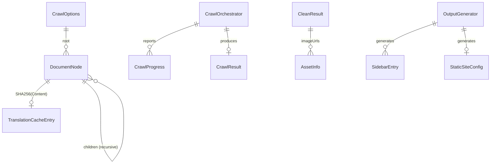

# Data Model: 中英双语翻译、静态站点输出与 MAUI 桌面端

**Date**: 2026-05-31
**Status**: Complete
**Related**: [spec.md](./spec.md) | [research.md](./research.md)

## Entity Relationship



## New Models

### CrawlProgress (进度报告 DTO)

用于 `IProgress<CrawlProgress>` 实时进度报告，在 MAUI 抓取页和 CLI 日志中共用。

| Field | Type | Description |
|-------|------|-------------|
| `Phase` | `CrawlPhase` enum | 当前阶段：UrlTransform / SidebarParse / PageFetch / HtmlClean / AssetDownload / Translation / Output |
| `TotalPages` | `int` | 总页面数 |
| `CompletedPages` | `int` | 已完成页面数 |
| `CurrentPageTitle` | `string?` | 当前处理的页面标题 |
| `LogMessage` | `string?` | 日志消息 |
| `LogLevel` | `LogLevel` enum | 日志级别：Info / Warning / Error |

```csharp
namespace DeepWikiFetcher.Shared.Models;

public enum CrawlPhase
{
    UrlTransform,
    SidebarParse,
    PageFetch,
    HtmlClean,
    AssetDownload,
    Translation,
    Output
}

public sealed class CrawlProgress
{
    public CrawlPhase Phase { get; set; }
    public int TotalPages { get; set; }
    public int CompletedPages { get; set; }
    public string? CurrentPageTitle { get; set; }
    public string? LogMessage { get; set; }
    public LogLevel LogLevel { get; set; } = LogLevel.Information;
}
```

### TranslationCacheEntry (翻译缓存记录)

SQLite `translation_cache` 表的 ORM 映射。整页粒度缓存。

| Field | Type | Description |
|-------|------|-------------|
| `SourceHash` | `string` | 原文 SHA256（主键） |
| `PageUrl` | `string` | 页面 URL（辅助索引） |
| `SourceText` | `string` | 原始 Markdown 正文 |
| `TranslatedText` | `string` | 翻译后 Markdown 正文 |
| `Model` | `string` | 翻译模型标识（区分不同模型结果） |
| `CachedAt` | `DateTimeOffset` | 缓存时间 |
| `ExpiresAt` | `DateTimeOffset` | 过期时间（默认 +30 天） |

```csharp
namespace DeepWikiFetcher.Shared.Models;

public sealed class TranslationCacheEntry
{
    public string SourceHash { get; set; } = string.Empty;
    public string PageUrl { get; set; } = string.Empty;
    public string SourceText { get; set; } = string.Empty;
    public string TranslatedText { get; set; } = string.Empty;
    public string Model { get; set; } = string.Empty;
    public DateTimeOffset CachedAt { get; set; }
    public DateTimeOffset ExpiresAt { get; set; }
}
```

### AssetInfo (图片资源信息)

| Field | Type | Description |
|-------|------|-------------|
| `OriginalUrl` | `string` | 原始图片 URL |
| `LocalFileName` | `string` | 本地文件名（SHA256 + 扩展名） |
| `Downloaded` | `bool` | 是否下载成功 |

```csharp
namespace DeepWikiFetcher.Shared.Models;

public sealed class AssetInfo
{
    public string OriginalUrl { get; set; } = string.Empty;
    public string LocalFileName { get; set; } = string.Empty;
    public bool Downloaded { get; set; }
}
```

### SidebarEntry (侧边栏条目，VuePress 兼容)

用于 `sidebar.json` 序列化。递归结构，与 VuePress sidebar 格式完全兼容。

| Field | Type | Description |
|-------|------|-------------|
| `Title` | `string` | 页面标题 |
| `Path` | `string` | 相对路径（如 `/zh-cn/pages/1-installation.html`） |
| `Children` | `List<SidebarEntry>?` | 子条目（可选） |

```csharp
namespace DeepWikiFetcher.Shared.Models;

public sealed class SidebarEntry
{
    public string Title { get; set; } = string.Empty;
    public string Path { get; set; } = string.Empty;
    public List<SidebarEntry>? Children { get; set; }
}
```

### StaticSiteConfig (静态站点配置)

对应生成的 `config.js`。每个语言版本独立一份。

| Field | Type | Description |
|-------|------|-------------|
| `SiteTitle` | `string` | 站点标题 |
| `DefaultLanguage` | `string` | 默认语言（`zh-cn` / `en`） |
| `AvailableLanguages` | `List<string>` | 可用语言列表 |
| `RepoKey` | `string` | 仓库标识（`owner/repo`） |

```csharp
namespace DeepWikiFetcher.Shared.Models;

public sealed class StaticSiteConfig
{
    public string SiteTitle { get; set; } = string.Empty;
    public string DefaultLanguage { get; set; } = "en";
    public List<string> AvailableLanguages { get; set; } = [];
    public string RepoKey { get; set; } = string.Empty;
}
```

## Modified Models

### DocumentNode (新增 TranslatedContent)

| Field | Type | Change | Description |
|-------|------|--------|-------------|
| `TranslatedContent` | `string?` | **NEW** | 翻译后的页面正文（Markdown），翻译阶段填充，初始为 null |

所有现有字段不变：`Title`、`TranslatedTitle`、`Url`、`Depth`、`Number`、`Children`、`Content`。

### TranslationOptions (完善配置字段)

| Field | Type | Change | Description |
|-------|------|--------|-------------|
| `Enabled` | `bool` | EXISTING | 翻译开关 |
| `BaseUrl` | `string` | EXISTING | API 地址 |
| `ApiKey` | `string` | EXISTING | API 密钥 |
| `Model` | `string` | EXISTING | 模型名称 |
| `MaxConcurrency` | `int` | **NEW** | 翻译并发数，默认 1（避免 API 限流） |
| `BatchSize` | `int` | **NEW** | 翻译批大小，默认 10 页/批 |
| `CacheExpirationDays` | `int` | **NEW** | 缓存过期天数，默认 30 |
| `RequestDelayMs` | `int` | **NEW** | 翻译请求间隔（毫秒），默认 1000 |

### CleanResult (新增 AssetInfos)

| Field | Type | Change | Description |
|-------|------|--------|-------------|
| `AssetInfos` | `List<AssetInfo>` | **NEW** | 下载完成的图片资源列表（AssetDownloader 填充） |

## Existing Models (reference from 001)

| Model | Layer | Description |
|-------|-------|-------------|
| `CrawlOptions` | Shared | 爬取参数（GitHubUrl, OutputRoot, OutputFormat, TranslationEnabled） |
| `CrawlResult` | Shared | 爬取统计（RepoKey, TotalPages, SuccessCount, FailCount, Duration, OutputPath） |
| `CleanResult` | Shared | 清洗结果（CleanHtml, ImageUrls, **AssetInfos NEW**） |
| `PageCacheEntry` | Shared | 页面缓存（UrlHash, Url, Content, CachedAt, ExpiresAt） |
| `CrawlMetadata` | Shared | 爬取元数据（RepoKey, StartedAt, CompletedAt, Status, TotalPages, SuccessPages, FailedPages） |

## Enum Definitions

### CrawlPhase (NEW)

```csharp
public enum CrawlPhase
{
    UrlTransform,    // URL 转换
    SidebarParse,    // 侧边栏解析
    PageFetch,       // 页面获取
    HtmlClean,       // HTML 清洗
    AssetDownload,   // 图片下载
    Translation,     // 翻译
    Output           // 输出生成
}
```

### OutputFormat (EXISTING)

```csharp
public enum OutputFormat
{
    Markdown,    // .md 文件输出
    StaticSite   // .html 静态站点输出
}
```

## Validation Rules

| Entity | Rule |
|--------|------|
| `TranslationCacheEntry.SourceHash` | 非空，64 字符十六进制（SHA256） |
| `TranslationCacheEntry.PageUrl` | 非空，有效 URL 格式 |
| `TranslationCacheEntry.Model` | 非空（默认 `""` 表示未指定模型） |
| `CrawlProgress.TotalPages` | ≥ 0，≥ CompletedPages |
| `AssetInfo.OriginalUrl` | 非空，仅限 DeepWiki 域名 |
| `SidebarEntry.Title` | 非空 |
| `SidebarEntry.Path` | 非空，以 `/` 开头 |
